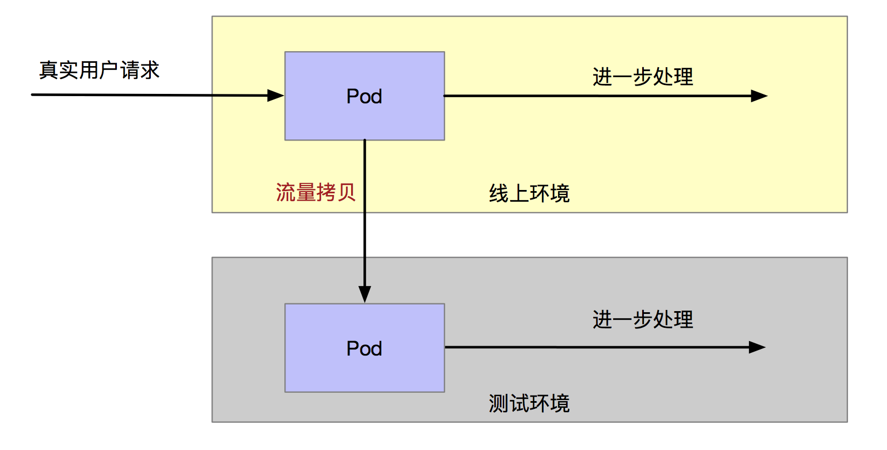
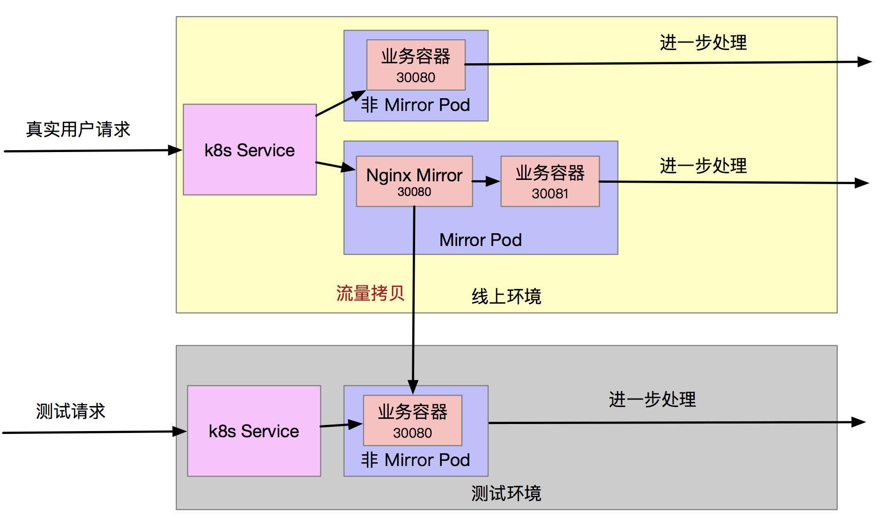
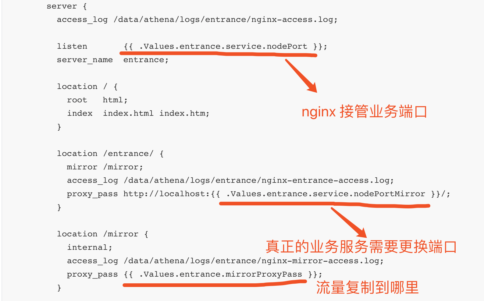
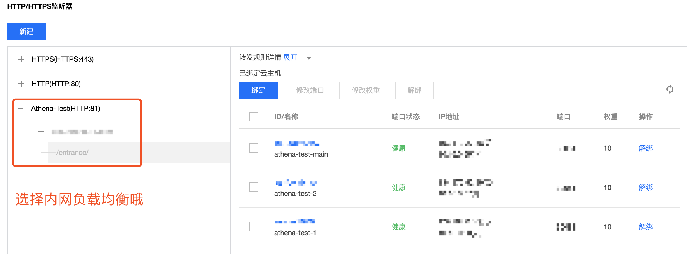

作者：田小康


# 背景

测试环境没有真实的数据, 会导致很多测试工作难以展开, 尤其是一些测试任务需要使用生产环境来做时, 会极大影响现网的稳定性。

我们需要一个流量复制方案, 将现网流量复制到预发布/测试环境



### 期望

- 将线上请求拷贝一份到预发布/测试环境
- 不影响现网请求
- 可配置流量复制比例, 毕竟测试环境资源有限
- 零代码改动

# 方案



- 承载入口流量的 Pod 新增一个 `Nginx 容器` 接管流量
- [Nginx Mirror](http://nginx.org/en/docs/http/ngx_http_mirror_module.html) 模块会将流量复制一份并 proxy 到指定 URL (测试环境)
- `Nginx mirror` 复制流量不会影响正常请求处理流程, 镜像请求的 Resp 会被 Nginx 丢弃
- `K8s Service` 按照 `Label Selector` 去选择请求分发的 Pod, 意味着不同Pod, 只要有相同 `Label`, 就可以协同处理请求
- 通过控制有 `Mirror 功能的 Pod` 和 `正常的 Pod` 的比例, 便可以配置流量复制的比例

我们的部署环境为 [腾讯云容器服务](https://cloud.tencent.com/product/tke), 不过所述方案是普适于 `Kubernetes` 环境的.

# 实现

PS: 下文假定读者了解
- [Kubernetes](https://kubernetes.io/docs/concepts/) 以及 YAML
- [Helm](https://helm.sh/)
- [Nginx](https://www.nginx.com/)

### Nginx 镜像

使用 Nginx 官方镜像便已经预装了 Mirror 插件

`docker pull nginx`

> `yum install nginx` 安装的版本貌似没有 Mirror 插件的哦, 需要自己装

### Nginx ConfigMap

```yaml
kind: ConfigMap
metadata:
  name: entrance-nginx-config
  namespace: default
apiVersion: v1
data:
  nginx.conf: |-
    worker_processes auto;

    error_log /data/athena/logs/entrance/nginx-error.log;

    events {
      worker_connections  1024;
    }

    http {
      default_type  application/octet-stream;
      sendfile        on;
      keepalive_timeout  65;

      server {
        access_log /data/athena/logs/entrance/nginx-access.log;

        listen       {{ .Values.entrance.service.nodePort }};
        server_name  entrance;

        location / {
          root   html;
          index  index.html index.htm;
        }

        location /entrance/ {
          mirror /mirror;
          access_log /data/athena/logs/entrance/nginx-entrance-access.log;
          proxy_pass http://localhost:{{ .Values.entrance.service.nodePortMirror }}/;
        }

        location /mirror {
          internal;
          access_log /data/athena/logs/entrance/nginx-mirror-access.log;
          proxy_pass {{ .Values.entrance.mirrorProxyPass }};
        }

        error_page   500 502 503 504  /50x.html;
        location = /50x.html {
          root   html;
        }
      }
    }
```

其中重点部分如下:



### 业务方容器 + Nginx Mirror

```yaml
{{- if .Values.entrance.mirrorEnable }}
apiVersion: extensions/v1beta1
kind: Deployment
metadata:
  name: entrance-mirror
spec:
  replicas: {{ .Values.entrance.mirrorReplicaCount }}
  template:
    metadata:
      labels:
        name: entrance
    spec:
      affinity:
        podAntiAffinity:
          preferredDuringSchedulingIgnoredDuringExecution:
            - weight: 1
              podAffinityTerm:
                labelSelector:
                  matchExpressions:
                    - key: "name"
                      operator: In
                      values:
                        - entrance
                topologyKey: "kubernetes.io/hostname"
      initContainers:
      - name: init-kafka
        image: "centos-dev"
        {{- if .Values.delay }}
        command: ['bash', '-c', 'sleep 480s; until nslookup athena-cp-kafka; do echo "waiting for athena-cp-kafka"; sleep 2; done;']
        {{- else }}
        command: ['bash', '-c', 'until nslookup athena-cp-kafka; do echo "waiting for athena-cp-kafka"; sleep 2; done;']
        {{- end }}

      containers:
      - image: "{{ .Values.entrance.image.repository }}:{{ .Values.entrance.image.tag }}"
        name: entrance
        ports:
        - containerPort: {{ .Values.entrance.service.nodePort }}
        env:
          - name: ATHENA_KAFKA_BOOTSTRAP
            value: "{{ .Values.kafka.kafkaBootstrap }}"
          - name: ATHENA_KAFKA_SCHEMA_REGISTRY_URL
            value: "{{ .Values.kafka.kafkaSchemaRegistryUrl }}"
          - name: ATHENA_PG_CONN
            value: "{{ .Values.pg.pgConn }}"
          - name: ATHENA_COS_CONN
            value: "{{ .Values.cos.cosConn }}"
          - name: ATHENA_DEPLOY_TYPE
            value: "{{ .Values.deployType }}"
          - name: ATHENA_TPS_SYS_ID
            value: "{{ .Values.tps.tpsSysId }}"
          - name: ATHENA_TPS_SYS_SECRET
            value: "{{ .Values.tps.tpsSysSecret }}"
          - name: ATHENA_TPS_BASE_URL
            value: "{{ .Values.tps.tpsBaseUrl }}"
          - name: ATHENA_TPS_RESOURCE_FLOW_PERIOD_SEC
            value: "{{ .Values.tps.tpsResourceFlowPeriodSec }}"
          - name: ATHENA_CLUSTER
            value: "{{ .Values.cluster }}"
          - name: ATHENA_POD_NAME
            valueFrom:
              fieldRef:
                fieldPath: metadata.name
          - name: ATHENA_HOST_IP
            valueFrom:
              fieldRef:
                fieldPath: status.hostIP
          - name: ATHENA_POD_IP
            valueFrom:
              fieldRef:
                fieldPath: status.podIP

        command: ['/bin/bash', '/data/service/go_workspace/script/start-entrance.sh', '-host 0.0.0.0:{{ .Values.entrance.service.nodePortMirror }}']

        volumeMounts:
        - mountPath: /data/athena/
          name: athena
          readOnly: false

        imagePullPolicy: IfNotPresent

        resources:
          limits:
            cpu: 3000m
            memory: 800Mi
          requests:
            cpu: 100m
            memory: 100Mi

        livenessProbe:
          exec:
            command:
              - bash
              - /data/service/go_workspace/script/health-check/check-entrance.sh
          initialDelaySeconds: 120
          periodSeconds: 60

      - image: "{{ .Values.nginx.image.repository }}:{{ .Values.nginx.image.tag }}"
        name: entrance-mirror
        ports:
          - containerPort: {{ .Values.entrance.service.nodePort }}

        volumeMounts:
          - mountPath: /data/athena/
            name: athena
            readOnly: false
          - mountPath: /etc/nginx/nginx.conf
            name: nginx-config
            subPath: nginx.conf

        imagePullPolicy: IfNotPresent

        resources:
          limits:
            cpu: 1000m
            memory: 500Mi
          requests:
            cpu: 100m
            memory: 100Mi

        livenessProbe:
          tcpSocket:
            port: {{ .Values.entrance.service.nodePort }}
          timeoutSeconds: 3
          initialDelaySeconds: 60
          periodSeconds: 60

      terminationGracePeriodSeconds: 10

      nodeSelector:
        entrance: "true"

      volumes:
        - name: athena
          hostPath:
            path: "/data/athena/"
        - name: nginx-config
          configMap:
            name: entrance-nginx-config

      imagePullSecrets:
        - name: "{{ .Values.imagePullSecrets }}"
{{- end }}
```

上面为真实在业务中使用的 Deployment 配置, 有些地方可以参考:
- `valueFrom.fieldRef.fieldPath` 可以取到容器运行时的一些字段, 如 `NodeIP`, `PodIP` 这些可以用于全链路监控
- `ConfigMap` 直接 Mount 到文件系统, 覆盖默认配置的例子
- `affinity.podAntiAffinity` 亲和性调度, 使 Pod 在主机间均匀分布
- 使用了 `tcpSocket` 和 `exec.command` 两种健康检查方式


### Helm Values

```yaml
# entrance, Athena 上报入口模块
entrance:
  enable: true
  replicaCount: 3
  mirrorEnable: true
  mirrorReplicaCount: 1
  mirrorProxyPass: "http://10.16.0.147/entrance/"
  image:
    repository: athena-go
    tag: v1901091026
  service:
    nodePort: 30081
    nodePortMirror: 30082
```

如上, `replicaCount: 3` + `mirrorReplicaCount: 1` = 4 个容器, 有 1/4 流量复制到 `http://10.16.0.147/entrance/`


### 内网负载均衡

流量复制到测试环境时, 尽量使用内网负载均衡, 为了成本, 安全及性能方面的考虑



# 总结

通过下面几个步骤, 便可以实现流量复制啦

- 建一个内网负载均衡, 暴漏测试环境的 `服务入口 Service`
- `服务入口 Service` 需要有可以更换端口号的能力 (例如命令行参数/环境变量)
- 线上环境, 新增一个 Deployment, Label 和之前的 `服务入口 Service` 一样, 只是端口号分配一个新的
- 为新增的 Deployment 增加一个 Nginx 容器, 配置 nginx.conf
- 调节有 `Nginx Mirror` 的 Pod 和 正常的 `Pod` 比例, 便可以实现`按比例流量复制`